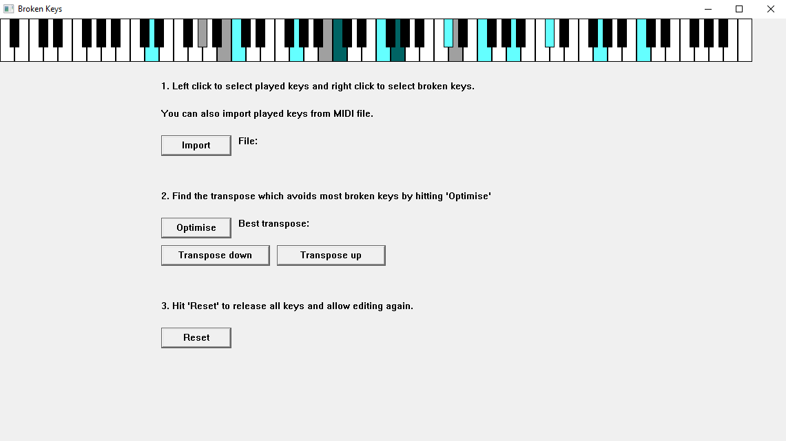

# Broken Keys

## 1. Description
Win32 application to find the optimal transpose if your piano has broken keys.

## 2. Features
The application takes two sets of keys from the user: keys played in a song and keys that are broken. After setting the keys, the user can then compute the optimal transpose that minimises the overlap between the two sets.

   
    <p><em>Figure 1: Application user interface.</em></p>

As seen from above figure, the user interface is quite simple and self-explanatory. Here is a quick overview of the main controls:

### 2.1. Keyboard
Right clicking a key sets the key as broken (gray). Left clicking a key sets the key as played (light blue). If the key is both played and broken, it will appear as dark blue. The keys cannot be edited after optimising until the 'Reset' button is clicked.

### 2.2. Import
TODO

### 2.3. Optimise
This button will transpose the played keys across the entire keyboard and find the transpose which has the least amount of keys that are both played and broken, and which is the closest to the original transpose. Optimising will prevent further editing until 'Reset' button is clicked.

### 2.3. Transpose up and down
As the name suggests, these buttons will transpose the played keys up or down one semitone. Transposing beyond the first or last key is not allowed.

### 2.4. Reset
This will remove the clicked status of all keys and reset internal variables. It will also unlock editing if it was disabled after optimising.

## 3. Building

### 3.1. Prerequisites 
1. Windows OS from this millenium
2. C++ compiler (GCC, Clang, etc.)
3. Cmake (v3.15 and above)

You might also need to install Windows SDK for windows.h. For the compilers and build tools I would just install MSYS2.

### 3.2. Clone the repository
To clone this project to your local machine, run the following command:
```
git clone https://github.com/nkujanen/broken-keys.git
cd broken-keys
```

### 3.3. Build with Cmake
Make sure you are in the root directory and run the following commands:
```
cmake -S . -B build
cmake --build build
```

The first command specifies the source and build directories. Since there is no 'build/' directory, cmake will create one. The second command builds the project inside the newly created 'build/' directory.

## 4. TODO

1. Add MIDI support to allow importing played keys
2. Add tests